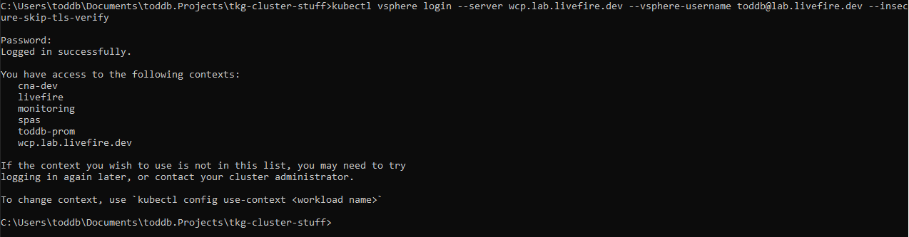
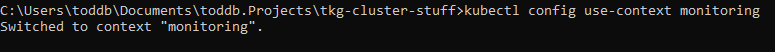

## SIMPLE tutorial on createing a TKG cluster on vSphere 7 ##

#### Step 1 ####

Log Into vsphere using kubectl vsphere plugin
```
kubectl vsphere login --server wcp.lab.livefire.dev --vsphere-username <user name> --insecure-skip-tls-verify
```

You will be asked to enter your password and then be shown the vSphere Workload Management Namespaces You have access to



#### Step 2 #### 

Switch vSphere with Tanzu Workload Managment Namespace 

```
kubectl config use-context <Workload Managment Namespace>
```



#### Step 3 #### 

Create yaml to create tkg cluster using kubectl

example
```
apiVersion: run.tanzu.vmware.com/v1alpha1
kind: TanzuKubernetesCluster                   
metadata:
  # Name of cluster example tkg-cluster-01
  name: toddb-prom-02                        
  # vSphere Workload Management Nameapace to deploy cluster to
  namespace: monitoring                       
spec:
  distribution:
    version: v1.18                             
  topology:
    controlPlane:
      # Number of Nodes in Controlplane
      count: 1                                 
      #
      class: best-effort-small               
      #vSphere storage class to use get this from vsphere admin  
      storageClass: vsphere-with-kubernetes 
    workers:
      #
      count: 4                
      #                 
      class: best-effort-small     
      #vSphere storage class to use get this from vsphere admin
      storageClass: vsphere-with-kubernetes
```

#### Step 4 #### 


Use kubectl apply -f with valid tkg yaml

``` 
kubectl apply -f <tkg.cluster.deployment.yaml>
```

#### Step 5 ####

Switch to the context of the cluster you just deployed

```
kubectl get tanzukubernetesclusters
```

Have a deeper look at your shiny new cluster

```
kubectl describe tanzukubernetescluster CLUSTER-NAME
```

Now that the cluster is up log directly into it.

```
kubectl vsphere login --server=IP-ADDRESS --vsphere-username USERNAME --insecure-skip-tls-verify --tanzu-kubernetes-cluster-name CLUSTER-NAME --tanzu-kubernetes-cluster-namespace NAMESPACE
```


To delete the cluster use

```
kubectl delete -f <tkg.cluster.deployment.yaml>
```
Documentation used for this simple tutorialL
https://docs.vmware.com/en/VMware-vSphere/7.0/vmware-vsphere-with-tanzu/GUID-0C2A88B3-6CB8-4495-B707-43710B94C7F6.html